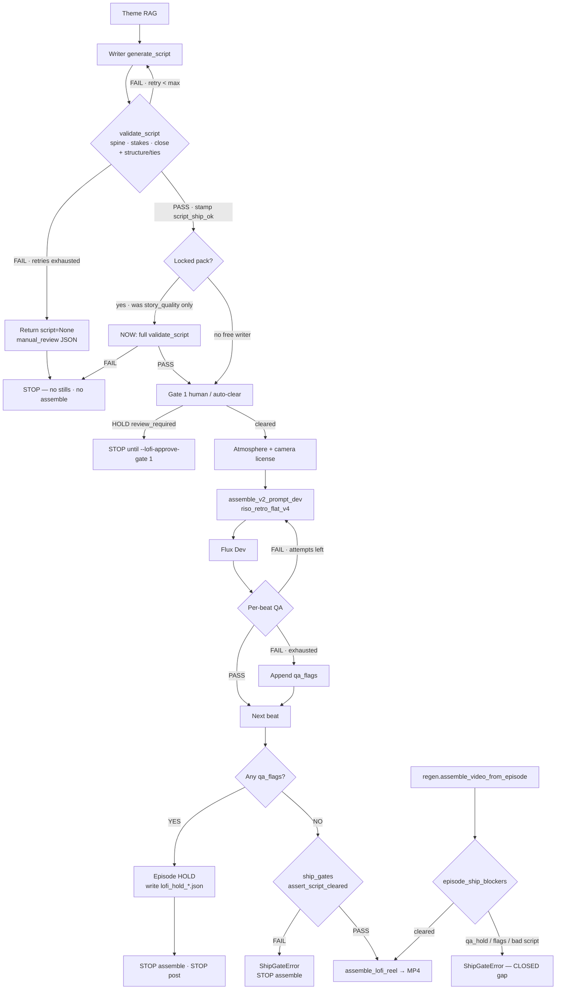

# riso_retro_flat_v4 — structural report + ship gates

**Date:** 2026-08-26  
**Live code:** `core/economic_reel_lofi/`  
**Style profile:** `style-riso_painting_retro_vintage` → alias `riso_retro_flat_v4` (`visual_identity_profiles.py`)  
**Flux:** `LOFI_FLUX_BACKEND=dev` → `assemble_v2_prompt_dev` / DeepInfra FLUX-1-dev  

Companion canvas (open beside chat): `canvases/riso-retro-flat-v4-gates.canvas.tsx`  
Prior leak diagnosis (kitchen/CFG): [`riso_retro_flat_v4_pipeline_20260825.md`](./riso_retro_flat_v4_pipeline_20260825.md)

---

## 0. Ship-gate finding (2026-08-26)

### What slipped through

| Attempt | Path | Script gate | Visual gate | Assembled? |
|---------|------|-------------|-------------|------------|
| Free writer ×3 + fallback | `_generate_validated_script` | **REJECT** → `None` | never ran | **No** (correct) |
| Manual multi-place `--lofi-script` | Locked path | Only `assess_story_quality` (PASS) — **not** full `validate_script` | QA HOLD (11 flags) | Pipeline **No**; then `regen.assemble_video_from_episode` **Yes** (gap) |

Root cause of the shipped MP4: **assemble bypass**, not the free writer. Hold meta + VO/stills were fed to `assemble_video_from_episode`, which had **zero** script/visual ship checks.

Post-atmosphere, that same multi-place script **fails** full `validate_script` (caption↔object ties, missing `subject_expression` / `setting` after world stamp). Story-quality alone was a weaker gate than the five approved packs used.

### Closures (this change)

| Path | Before | After |
|------|--------|-------|
| Locked `--lofi-script` | `assess_story_quality` only | Full `validate_script` (`persist_on_pass=False`); fail → manual_review, no stills |
| Pipeline pre-`assemble_lofi_reel` | Assumed prior HOLD enough | `assert_script_cleared_for_assemble` + refuse if `qa_flags` still set |
| `regen.assemble_video_from_episode` | Always assembled | `assert_episode_cleared_for_assemble` — blocks `mode=qa_hold*`, `visual_qa_flags`, failed validator |
| Force-env bypass | n/a | **None** — hard stop only |

Module: `core/economic_reel_lofi/ship_gates.py` (`ShipGateError`).

Distance multi-place episode is **discarded** (`mode=discarded` on its reel sidecar). Do not patch its 9 lines; re-run distance later via writer + full gate like the other five.

### Beat-count / “8 scenes” finding (same day)

The discarded distance MP4 was **not** a silent 8-beat drop. Hold + assemble logs and sidecar all show **9** stills, **9** captions, **9** VO files. Duration was **24.15s** because `slot_duration_for_vo` returned `vo + trail` even when that was **below** the 3.0s base — so the reel *felt* like ~8×3s slots.

| Check | Result |
|-------|--------|
| QA fail → drop beat from assemble list? | **No** — failed beats stay in `scene_paths`, `qa_flags` set, episode HOLD |
| Silent shorter video from missing beat? | **Not the path** — integrity now hard-blocks if still/VO count ≠ script lines |
| Why ~8-scene feel? | Slot shrink bug — **fixed**: `slot_duration_for_vo` = `max(base, vo+trail)` → 9×3.0s = 27s min |

---

## 1. End-to-end stages

What `riso_retro_flat_v4` does as a **system** (writer → pixels → MP4). The style tag itself is only the Dev prompt envelope; narrative gates live in writer/validator/ship_gates.

| # | Stage | Owns | Enforces | Does **not** enforce |
|---|--------|------|----------|----------------------|
| 1 | Theme / RAG | `lofi_collections.select_theme`, concrete details, hooks | LRU theme/detail pick | Narrative coherence |
| 2 | Writer | Claude batch + DeepSeek alts (`generate_script`) | 9w/56c attempts, rhetoric/anchor patterns | Ship readiness until validator |
| 3 | Validator | `validator_agent.validate_script` | Structure, hooks, caps, caption↔setting/object (v2), dedup, safety, **story_quality** (spine / stakes / close) | Pixel quality; post-atmosphere drift unless revalidated |
| 4 | Ship stamp | `script_ship_ok` on pass | Marks cleared scripts | — |
| 5 | Gate 1 (optional) | `review_gates` | Human approve script when `review_required` | Skipped if `--lofi-no-review` or locked script auto-clears Gate 1 |
| 6 | Atmosphere / world | `apply_episode_atmosphere`, `_EPISODE_WORLDS` | Place-first zone table, lighting lock | Spoken caption fidelity (can overwrite setting/object) |
| 7 | Camera / licensing | framing variety, spoken-prop license list, object-focus steps | Composition quotas; licensed stems for negatives | That Flux obeys licenses |
| 8 | Prompt assemble | `assemble_v2_prompt_dev` + profile `riso_retro_flat_v4` | Riso/vintage open, palette, scene string, negatives | CFG 5.5 vs named-room priors (see 2026-08-25 doc) |
| 9 | Flux Dev | `generate_scene_image_dev` | Image bytes | Semantic match to caption |
| 10 | Per-beat QA | VisualQA, spoken_prop, object/style/coverage/hook… | Retry ≤ attempts; flags on exhaust | Stopping assemble by itself until episode rollup |
| 11 | Episode visual HOLD | `qa_flags` rollup | **Blocks** pipeline assemble + post | Historically bypassable via `assemble_video_from_episode` — **closed** |
| 12 | Assemble | `assemble_lofi_reel` | Ken Burns, captions, VO, BGM, logo | Script sense (must be gated upstream) |

---

## 2. Gate decision flowchart (Mermaid)

### FAIL behavior cheat sheet

| Gate node | On FAIL |
|-----------|---------|
| `validate_script` (writer loop) | Retry; then `None` → **blocks** stills + assemble |
| Locked pack validator | **blocks** stills + assemble (same as writer) |
| Gate 1 human | **blocks** image/TTS until approve |
| Per-beat QA | Retry; then flag — stills may remain on disk |
| Episode `qa_flags` HOLD | **blocks** pipeline assemble + post |
| `ship_gates` pre-assemble | **blocks** assemble (`ShipGateError`) |
| `assemble_video_from_episode` | **blocks** if hold mode / flags / failed script (**was silent proceed — fixed**) |
| Style mix soft gate | Can HOLD mix-era; separate from script |

---

## 3. What story_quality actually checks

From `agents/writer/script_agent.assess_story_quality` (embedded in `validate_script`):

1. **Causal spine** — ≥75% of consecutive pairs linked by connective or shared stems (need ≥6 of 8 on a 9-liner).  
2. **Stakes** — at least one line matches risk/loss language.  
3. **Close** — last line is a usable takeaway (`_TAKEAWAY_RE`), not a bare aphorism.

This is necessary but not sufficient: full `validate_script` also ties captions to settings/objects, hook types, caps, dedup, safety. The five approved packs cleared **full** validation; the multi-place pack cleared **story_quality only**, then drifted after atmosphere.

---

## 4. Style module vs narrative module

`riso_retro_flat_v4` does **not** write monologue. It is the Dev visual identity profile:

- Open / technique strings for riso-poster illustration  
- Wired through `assemble_v2_prompt_dev` when `LOFI_FLUX_BACKEND=dev`  
- Shared by all relationship packs that use the default profile  

Narrative coherence is entirely writer + `validate_script` + `ship_gates`. Multi-place slideshows that “pass” a weak gate are a **gate bug**, not a Flux bug.

---

## 5. Re-attempt distance (later)

1. Do **not** reuse the discarded multi-place JSON or MP4.  
2. Run free writer: `--lofi-theme distance` (no `--lofi-script`), full validator must PASS.  
3. If visual HOLD fires, leave it held — do not call `assemble_video_from_episode` on hold meta.  
4. Only assemble when `script_ship_ok` and `visual_qa_flags` are empty.
